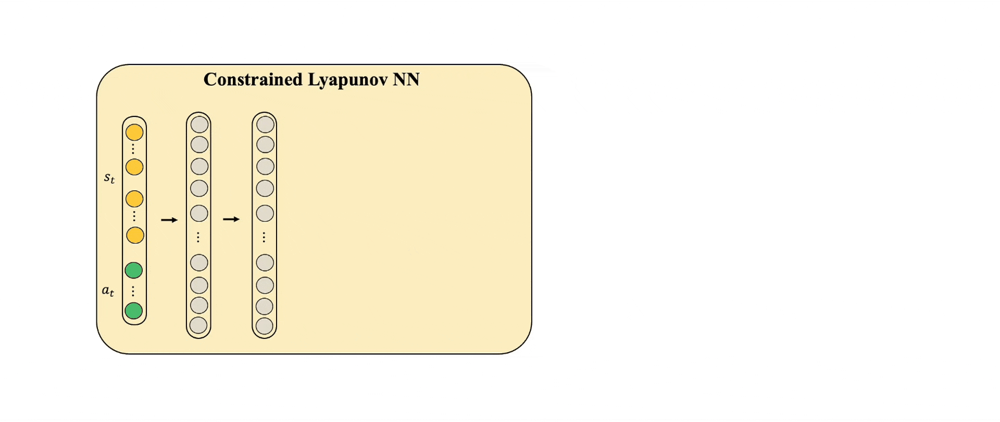
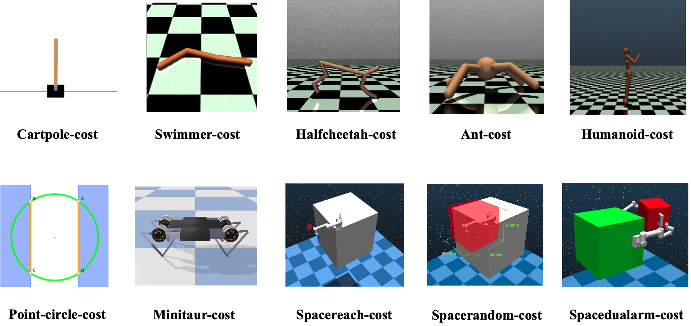
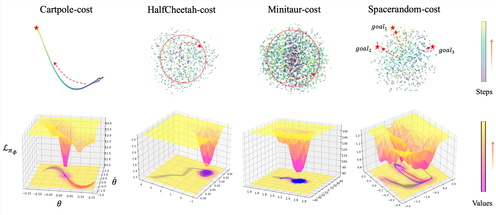

# Adaptive Lyapunov-based Actor-Critic
- [Project webpage](https://sites.google.com/view/adaptive-lyapunov-actor-critic)
- our paper is accepted by CoRL2023. The paper can be found in [Openreview](https://openreview.net/forum?id=rOCWUmMBSnH).
We present GIFs below to show the architecture of ALAC.

<div align=center>

</div> 


## Installation


### Mujoco
Following the instructios in https://github.com/openai/mujoco-py to setup a mujoco environment. In the end, remember to set the following environment variables:
``` Bash
LD_LIBRARY_PATH=${HOME}/.mujoco/mujoco200/bin;
LD_PRELOAD=/usr/lib/x86_64-linux-gnu/libGLEW.so
```

If mujoco downloaded was 210 and saved to mujoco210 the mujocopy version from requirements might not work so try
```
pip3 install -U 'mujoco-py<2.2,>=2.1'
```
Note: you should ensure the versions of the mujoco and the mujoco-py are the same. 

### Create environment
```bash
conda create -n alac python=3.6
conda activate alac
pip install -r requirements.txt
```

## Quick start

Then, you can run 
```bash
python main.py 
```
Hyperparameters for training ALAC are ready to run by default. 

If you want to test other environments, please open CONFIG.py and modify corresponding 'env_name'. For the names of environment see the following part.

For evaluation, you can choose `'train': False,` in `CONFIG.py`, and then run `python main.py `. 


## Environments
We test our method and other baselines in ten robotic control environments, including Cartpole-cost,Pointcircle-cost, HalfCheetah-cost, Swimmer-cost, Ant-cost, Humanoid-cost, Minitaur-cost, Spacereach-cost, Spacerandom-cost and Spacedualarm-cost. 

<div align=center>

</div> 

## Visualization
We use t-SNE to illustrate the system's stability learned by ALAC in 3D. In dynamical systems theory, a system's phase space can be represented as a sign of stability. Thus, we also show various phase space trajectories to analyze the form of stability. Finally, we show convergence to a single point or circle for the state and phase trajectory.

<div align=center>

</div> 

## Experiments results

We provide the details of experimental results in the paper. Please see the Appendix.

## Future plan

We will release the full version with all baselines after the paper is published. 
